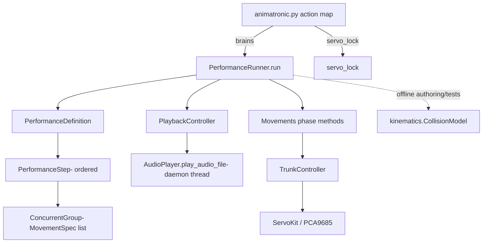

# Design Document

## Overview

This feature adds a reusable **Performance Framework** to `animatronic-v2`: a
single coordination layer that composes existing `Movements` gestures over one
dialog audio track, handling concurrency, sequential chaining, audio gating,
looping for the audio's duration, and return-to-rest. The framework is the
deliverable; individual performances (starting with `brains`) become small
declarative descriptions rather than new coordination code.

The design is driven by two timing needs the existing timer-based
`run_action_and_audio` cannot meet:

1. **Gated audio start** — dialog begins only when a movement reaches a chosen
   physical state (e.g. "arm fully raised"), not after a fixed idle delay.
2. **Audio-driven duration** — the composed movements loop until playback
   completes, so gesture length follows the audio rather than a fixed count.

The framework layers cleanly on top of the current architecture. It sits beside
`Movements` at the mid level, consumes `Movements` gestures as opaque building
blocks, drives them through `TrunkController`, and is invoked from
`animatronic.py` under the existing servo-lock / root execution model. No audio
logic enters the movement layer; all audio/gate/loop/sequence coordination lives
in one place.

### Key design decisions

- **Declarative `PerformanceDefinition` + generic runner.** Coordination logic
  exists once in a `PerformanceRunner`; each performance is data (steps,
  audio, gate, timing). Adding a performance = adding a definition + registering
  an action (Req 1, 3, 11).
- **Movement phases over monolithic coroutines.** Looping gestures expose
  `lead_in` / `loop_body` / `return` phases so the runner can time any movement
  generically without knowing its choreography (Req 9). Existing standalone
  gestures keep working unchanged.
- **`asyncio` all the way down.** The framework is async, matching `Movements`
  and `TrunkController`. Concurrent groups use `asyncio.gather`; the audio
  player continues to run in its existing background daemon thread, bridged to
  asyncio via a thread-safe playback flag and an `asyncio.Event` gate.
- **Channel ownership as the concurrency guarantee.** Concurrent movements must
  own disjoint servo channels — the same rule `movements.py` already documents.
  The framework validates disjointness up front and treats overlap as an
  authoring error (Req 2, 4, 10).
- **Collision safety stays offline.** The existing `kinematics.CollisionModel`
  validates composed keyframes during authoring/tests; it is not a runtime
  gate (it imports no hardware and is an authoring aid). Combined extreme poses
  are validated as part of the testing strategy (Req 10).

## Architecture

The framework introduces one new module, `src/performance.py`, and extends
`Movements` with phase-exposing methods. It reuses `AudioPlayer`, `servo_lock`,
and `animatronic.py`'s action map without changing their contracts.



### Execution flow (single performance)

1. `animatronic.py` dispatches the named action under `servo_lock()` (fail-fast
   if busy), exactly like existing routines (Req 11.4).
2. The action builds the `PerformanceDefinition` and calls
   `asyncio.run(PerformanceRunner(defn).run())` — `asyncio.run` at the top of
   the stack, per project convention.
3. The runner starts every step's movements. Ungated movements start at time
   zero; a gated movement runs its `lead_in`, and when it reaches its gate
   state it signals the `PlaybackController`, which starts `AudioPlayer` in a
   daemon thread (Req 6).
4. While playback is active, each looping movement repeats its `loop_body`,
   checking the playback flag between whole iterations (Req 7).
5. When playback ends, the runner stops issuing new loop iterations and runs
   each movement's `return` phase; then it returns servos to rest (Req 8).
6. On any exception, the runner drives all servos to safe rest, preserving the
   existing `_safe_rest` behavior (Req 8.3).

### How this replaces the two motivating limitations

- `run_action_and_audio` starts audio then sleeps a fixed `idle` before the
  gesture. The runner instead **gates** audio on a movement condition and
  **loops** the gesture until playback ends — both parameterized by the
  definition.

## Components and Interfaces

All new code lives in `src/performance.py` unless noted. Naming follows project
conventions (`PascalCase` classes, `snake_case` functions, Google-style
docstrings, `print()` for debug output).

### `MovementPhases` (protocol / duck-typed shape)

A looping `Movements` gesture usable by the framework exposes three async
phases with a uniform shape (Req 9.1):

```python
class MovementPhases:
    owned_channels: set[int]          # servo channels this movement drives
    async def lead_in(self) -> None:  # optional one-time entry (may be no-op)
    async def loop_body(self) -> None # one repeatable iteration
    async def gate_reached(self) -> bool | asyncio.Event  # optional gate signal
    async def do_return(self) -> None # bring owned channels to rest
```

- Phases contain **no audio logic** (Req 9.2). They only drive servos.
- `owned_channels` makes Channel_Ownership machine-checkable (Req 4.2, 10.1).
- The gate is optional; ungated movements omit it (Req 6.3).

To avoid a heavy refactor and preserve existing standalone behavior, phases are
provided by thin **phase adapters** rather than by rewriting each gesture. A
`MovementSpec` binds a movement's phase methods together with its owned channels
and gate.

### `MovementSpec`

```python
@dataclass(frozen=True)
class MovementSpec:
    name: str
    owned_channels: frozenset[int]
    lead_in: Callable[[], Awaitable[None]] | None
    loop_body: Callable[[], Awaitable[None]]
    do_return: Callable[[], Awaitable[None]] | None
    supplies_gate: bool = False       # does this movement's lead_in satisfy the audio gate?
```

- Declares a movement's phases and channels for one performance (Req 3.1, 9.1).
- Reused across performances by reference, not copied (Req 3.3).

### `ConcurrentGroup`

```python
@dataclass(frozen=True)
class ConcurrentGroup:
    movements: tuple[MovementSpec, ...]
```

- One or more movements that run at the same time within a step (Req 2.1, 4.1).
- A group of one is a single movement (Req 2.5).
- Validated at construction/registration: the members' `owned_channels` must be
  pairwise disjoint, else `ChannelOwnershipError` (Req 4.2, 10.1).

### `PerformanceStep`

```python
@dataclass(frozen=True)
class PerformanceStep:
    group: ConcurrentGroup
    loop_for_audio: bool = False      # loop this step's bodies while playback active
```

- One entry in the ordered performance sequence (Req 2.2). `loop_for_audio`
  marks which step(s) loop for the audio duration, so multi-step performances
  don't assume a single looping step (Req 7.4).

### `PerformanceDefinition`

```python
@dataclass(frozen=True)
class PerformanceDefinition:
    name: str
    audio_file: str                   # filename in the audio dir
    steps: tuple[PerformanceStep, ...]
    gate: GateSpec | None = None      # which movement + condition gates audio
```

- The complete declarative description of one performance (Req 3.1).
- `gate is None` ⇒ audio starts at time zero (Req 6.4).
- Registered as a named action; adding one requires no runner changes
  (Req 1.3, 3.4, 11.1).

### `GateSpec`

```python
@dataclass(frozen=True)
class GateSpec:
    movement_name: str                # the movement whose lead_in opens the gate
```

- Names the movement supplying the Audio_Gate. The runner starts audio when
  that movement signals its gate (its `lead_in` completing, or an explicit
  `asyncio.Event`) (Req 6.1, 6.2, 6.5).

### `PlaybackController`

Bridges the thread-based `AudioPlayer` to the async runner.

```python
class PlaybackController:
    def __init__(self, audio_path: str): ...
    def start(self) -> None            # spawn AudioPlayer daemon thread, mark active
    def is_active(self) -> bool        # thread.is_alive() — Playback_Active
    def wait_finished(self, timeout=None) -> None   # join the audio thread
```

- Wraps the existing pattern from `animatronic.run_action_and_audio`: build an
  `AudioPlayer`, run `play_audio_file` in a `daemon=True` thread (Req 5.1).
- Exactly one track per performance; never restarted between steps (Req 5.2).
- `is_active()` derives Playback_Active from the audio thread being alive; it is
  the single source of truth the loop checks (Req 7.1).

### `PerformanceRunner`

The one place all coordination lives (Req 1.2).

```python
class PerformanceRunner:
    def __init__(self, definition: PerformanceDefinition,
                 movements: Movements, audio_dir: str): ...
    async def run(self) -> None
```

`run()` responsibilities:

- Validate every group's Channel_Ownership before moving (Req 4.2, 10.1).
- Execute steps in order; each step completes before the next begins (Req 2.2,
  2.4). The final step ending ends the performance (Req 2.4).
- For a step with a gated movement: start ungated movements' loops at time zero;
  run the gated movement's `lead_in`; when the gate signals, `start()` the
  `PlaybackController` (Req 6.1–6.3, 6.5).
- Drive `Loop_Until_Audio`: for each looping movement, repeat `loop_body` while
  `playback.is_active()`, checking the flag **between** whole iterations so a
  move completes cleanly (Req 7.1–7.3).
- After looping, run each movement's `do_return` (Req 8.1), then
  `trunkController.return_to_rest()` for any residual channels (Req 8.4).
- Wrap the body in try/except that calls the safe-rest recovery on any
  exception (Req 8.3). Verified-pose overrides remain scoped inside each
  movement's phases via `verified_pose_override` (Req 8.2, 9.5).

### `Movements` extensions (phase adapters)

Add phase methods that reuse existing motion, with no audio logic (Req 9.2, 9.3,
9.4). For `menacing_reach`, split the existing single coroutine into phases that
preserve the standalone behavior (reach, swing 3×, retract) when composed as
lead-in + one-swing loop-body + retract return:

```python
# menacing_reach phases (arm channels 4-7)
async def menacing_reach_lead_in(self)   # REACH out; opens the audio gate
async def menacing_reach_loop_body(self) # ONE menace swing (25<->55)
async def menacing_reach_return(self)    # RETRACT to rest

# look_around_random phases (neck channels 0,1)
async def look_scan_lead_in(self)        # center the head (no-op-ish)
async def look_scan_loop_body(self)      # ONE random glance + dwell
async def look_scan_return(self)         # return neck to center
```

- The verified-pose override for `menacing_reach`'s sub-floor shoulder tilt is
  applied within its phases and released when its return completes (Req 8.2,
  9.5). Because the override is scoped per-`with`-block, the runner keeps it
  open across lead-in→loop→return via an `AsyncExitStack` owned by the movement
  adapter, closing it in `do_return`.
- The existing `menacing_reach()` / `look_around_random()` remain for standalone
  use, delegating to the same primitives (Req 9.3).

### `brains` registration (`animatronic.py`)

- Add `'brains.wav'` to `Animatronic.music` with an index comment (Req 11.2).
- Add a `brains()` method that builds the `brains` `PerformanceDefinition` and
  runs it via the runner.
- Register `'brains': a.brains` in `action_map` inside `main()`, dispatched by
  the existing allowlist under `servo_lock()` (Req 11.1, 11.4). The
  control-panel/dashboard reaches it through the same action mechanism, no
  Node-RED (Req 11.3).

## Data Models

### The `brains` performance (worked example)

A single-step performance; the step's group runs two movements concurrently and
loops for the audio duration.

```python
BRAINS = PerformanceDefinition(
    name="brains",
    audio_file="brains.wav",          # ~15.2 s
    gate=GateSpec(movement_name="menacing_reach"),
    steps=(
        PerformanceStep(
            loop_for_audio=True,
            group=ConcurrentGroup(movements=(
                MovementSpec(
                    name="menacing_reach",
                    owned_channels=frozenset({
                        RT_SHOULDER_ROTATOR, RT_SHOULDER_TILT,
                        RT_ELBOW_TILT, RT_ELBOW_ROTATOR,   # 7,6,5,4
                    }),
                    lead_in=mv.menacing_reach_lead_in,     # reach out (gate)
                    loop_body=mv.menacing_reach_loop_body, # one menace swing
                    do_return=mv.menacing_reach_return,    # retract
                    supplies_gate=True,
                ),
                MovementSpec(
                    name="look_around_random",
                    owned_channels=frozenset({NECK_PAN, NECK_TILT}),  # 0,1
                    lead_in=None,                          # starts at t=0
                    loop_body=mv.look_scan_loop_body,      # one random glance
                    do_return=mv.look_scan_return,         # neck to center
                    supplies_gate=False,
                ),
            )),
        ),
    ),
)
```

- Arm channels `{4,5,6,7}` and neck channels `{0,1}` are disjoint ⇒ valid
  concurrent group (Req 4.3, 10.3).
- Head scan is ungated (starts at t=0); audio waits until the arm is fully
  raised (`menacing_reach_lead_in` completes) (Req 6.5).
- Both loop bodies repeat until `brains.wav` ends, then return to rest — arm
  retracts, neck centers (Req 7.5, 8.4).

### Channel ownership reference (from `constants.py`)

| Movement | Owned channels |
|----------|----------------|
| `menacing_reach` | 4 (elbow rot), 5 (elbow tilt), 6 (shoulder tilt), 7 (shoulder rot) |
| `look_around_random` | 0 (neck pan), 1 (neck tilt) |

### Playback state

`Playback_Active` is a derived boolean = `audio_thread.is_alive()`, owned by
`PlaybackController`. No separate mutable flag is needed; the thread liveness is
the signal (matching `AudioPlayer`'s existing blocking playback loop).

## Correctness Properties

*A property is a characteristic or behavior that should hold true across all
valid executions of a system — essentially, a formal statement about what the
system should do. Properties serve as the bridge between human-readable
specifications and machine-verifiable correctness guarantees.*

The framework's coordination logic is pure and deterministic enough to test as
universal properties when driven with **fake movements** (recording their own
calls) and a **fake `PlaybackController`** (whose `is_active()` flips false on a
controllable schedule), running the servo layer in `SERVO_SIM` mode so no
hardware is touched. The properties below were derived by consolidating the
prework analysis (redundant criteria merged).

### Property 1: Concurrent group runs its members together

*For any* `ConcurrentGroup` of movements with pairwise-disjoint channels, running
its step invokes every member's loop body (the members make progress within the
same step rather than one running to completion before another starts).

**Validates: Requirements 2.1, 4.1**

### Property 2: Steps run in order and the performance terminates

*For any* `PerformanceDefinition`, the steps execute in their declared order,
each step fully completes before the next begins (no cross-step overlap), and
`run()` returns after the final step completes.

**Validates: Requirements 2.2, 2.3, 2.4**

### Property 3: Channel ownership is enforced before any motion

*For any* `ConcurrentGroup`, construction/validation succeeds if and only if the
members' owned channel sets are pairwise disjoint; when any two members share a
channel the framework raises `ChannelOwnershipError` before issuing a single
servo write.

**Validates: Requirements 3.2, 4.2, 10.1**

### Property 4: Exactly one audio track per performance

*For any* `PerformanceDefinition`, the `PlaybackController` is started exactly
once during the whole run and the track is never restarted or switched between
steps.

**Validates: Requirements 5.1, 5.2**

### Property 5: Audio start is gated on movement progress

*For any* `PerformanceDefinition`, audio playback begins only after the gate
condition is signalled (never before); when no gate is specified audio begins at
time zero; and any ungated movement begins at time zero rather than waiting for
the gate.

**Validates: Requirements 6.1, 6.3, 6.4**

### Property 6: Loop bodies repeat for the audio duration and are never cut off

*For any* looping movement, its loop body is repeated while playback is active,
the active flag is checked only between whole loop-body iterations (so every
started iteration runs to completion), and once playback becomes inactive no new
iteration starts and the movement proceeds to its return phase.

**Validates: Requirements 5.3, 7.1, 7.2, 7.3**

### Property 7: Loop targeting follows the definition

*For any* multi-step `PerformanceDefinition`, only steps flagged
`loop_for_audio` repeat for the audio duration; every unflagged step runs its
bodies exactly once.

**Validates: Requirements 7.4**

### Property 8: Every owned channel ends at rest

*For any* `PerformanceDefinition` — including runs where a phase raises an
exception — after the performance ends every servo channel driven by the
performance has its final commanded angle equal to its `REST_POSITIONS` value
(no channel left energized against a jam), and between sequential steps driven
channels are returned to a known rest pose before the next step's lead-in.

**Validates: Requirements 8.1, 8.3, 8.4, 10.4**

### Property 9: Verified-pose overrides are scoped and clamped

*For any* `PerformanceDefinition` whose movements open a
`verified_pose_override`, after the run `TrunkController._limit_overrides` is
restored to its prior state, and every angle commanded during the run lies
within the effective clamp for its channel (the widened bounds only while the
override is active, the global `SAFE_LIMITS` otherwise).

**Validates: Requirements 8.2, 9.5**

### Property 10: Phased composition reproduces standalone behavior

*For any* run of `menacing_reach`'s phases composed as
`lead_in` + `loop_body` × 3 + `return`, the sequence of servo commands (channel,
angle) produced equals the sequence produced by the standalone
`menacing_reach()` gesture (reach, swing three times, retract).

**Validates: Requirements 9.3**

### Property 11: Scan glances stay within neck bounds

*For any* number of invocations of the `look_around_random` loop body, every
commanded neck-pan and neck-tilt angle lies within the gesture's declared scan
bounds (pan ∈ [PAN_MIN, PAN_MAX], tilt ∈ [TILT_MIN, TILT_MAX]).

**Validates: Requirements 9.4**

## Error Handling

- **Channel-ownership violation (authoring error).** `ConcurrentGroup`
  validation raises `ChannelOwnershipError` naming the shared channel(s) before
  any motion. Surfaced at definition-build/registration time so a bad
  performance never reaches the servos (Req 4.2, 10.1).
- **Gesture coroutine raises mid-performance.** `PerformanceRunner.run()` wraps
  the step/loop body in try/except; on any exception it logs the error and
  drives all servos to safe rest via `trunkController.return_to_rest()`,
  mirroring the existing `Animatronic._safe_rest` recovery (Req 8.3). The
  exception is not swallowed silently — it is logged with the offending phase.
- **Verified-pose override cleanup.** Overrides are opened via
  `TrunkController.verified_pose_override` (a context manager) held for the
  movement's lead-in→loop→return lifetime through an `AsyncExitStack`; its
  `finally` restores the previous overrides even when a phase raises (Req 8.2).
- **Servos busy.** Invocation goes through `servo_lock()`; if another routine
  holds the lock the action fails fast with `ServoBusyError` and
  `BUSY_EXIT_CODE`, exactly like existing routines (Req 11.4).
- **Audio thread lifetime.** `PlaybackController` runs `AudioPlayer` in a
  `daemon=True` thread and joins it (with a timeout) during teardown so audio
  resources are released even if the gesture side finishes first, matching
  `run_action_and_audio`'s existing join behavior (Req 5.1).
- **Simulation mode.** With `SERVO_SIM=1`, every servo write is logged rather
  than sent to hardware, letting the full framework (and all property tests)
  run with zero risk of physical motion.

## Testing Strategy

The framework's coordination logic is pure and deterministic when the servo
layer runs in `SERVO_SIM` mode and audio is a fake controller, so it is a strong
fit for property-based testing. Hardware-facing concerns (real audio playback,
the collision geometry) are covered by targeted integration/example tests
instead.

### Property-based tests

- **Library:** [Hypothesis](https://hypothesis.readthedocs.io/) (already present
  in the repo — see `.hypothesis/`), the standard PBT library for Python. Do not
  hand-roll property testing.
- **Configuration:** each property test runs a minimum of **100 iterations**
  (`@settings(max_examples=100)` or higher).
- **Tagging:** each property test is tagged with a comment referencing its
  design property, in the form:
  `# Feature: audio-synced-concurrent-gestures, Property {n}: {property text}`.
- **Coverage:** implement each of Properties 1–11 with a **single**
  property-based test. Generators produce random performances: random counts of
  fake movements with randomly-assigned disjoint (or deliberately overlapping,
  for Property 3) channel sets, random step sequences with random
  `loop_for_audio` flags, random gate placement (including `gate=None`), and a
  fake `PlaybackController` whose `is_active()` returns true for a
  randomly-chosen number of iterations.
- **Environment:** tests set `SERVO_SIM=1` and assert against the captured
  command log from the fake/simulated servo layer (no hardware, no real audio).
- **Test execution:** run quietly and stop on first failure, e.g.
  `pytest -q --maxfail=1 -k performance`.

Mapping of properties to the requirements they validate:

| Property | Validates |
|----------|-----------|
| P1 Concurrent group runs together | 2.1, 4.1 |
| P2 Ordered steps + termination | 2.2, 2.3, 2.4 |
| P3 Channel-ownership enforced pre-motion | 3.2, 4.2, 10.1 |
| P4 Exactly one audio start | 5.1, 5.2 |
| P5 Audio gated on movement progress | 6.1, 6.3, 6.4 |
| P6 Loop-until-audio, no mid-move cutoff | 5.3, 7.1, 7.2, 7.3 |
| P7 Loop targeting per definition | 7.4 |
| P8 Every owned channel ends at rest | 8.1, 8.3, 8.4, 10.4 |
| P9 Override scoped + clamped | 8.2, 9.5 |
| P10 Phased == standalone | 9.3 |
| P11 Scan bounds invariant | 9.4 |

### Unit / example tests

Focused example-based tests for the specific and structural criteria that are
not universal properties:

- **`brains` instance (2.5, 4.3, 6.5, 7.5, 8.4):** the one-step BRAINS
  definition runs its single concurrent group, gates audio on `menacing_reach`,
  starts the head scan at t=0, loops both bodies against a short fake track, and
  ends with the arm retracted and neck centered.
- **Opaque movements / extensibility (1.3, 1.4, 3.3, 3.4):** drive the runner
  with a stub movement exposing only the phase shape; register a second trivial
  definition through the same runner unchanged; assert two definitions can share
  the same `MovementSpec` by reference.
- **Definition shape (3.1):** constructing a `PerformanceDefinition` exposes
  steps, audio track, gate, and per-movement timing.
- **Phase protocol / no audio logic (9.1, 9.2):** the `menacing_reach` and
  `look_around_random` adapters expose the phase callables and `owned_channels`;
  a structural check confirms phase methods do not reference `AudioPlayer` /
  `PlaybackController`.
- **Prompt-start after gate (6.2):** structural assertion that no fixed idle
  `sleep` sits between the gate signal and `PlaybackController.start()`.
- **Registration / execution model (1.1, 1.2, 1.5, 11.1, 11.2, 11.3, 11.4):**
  `'brains'` is present in `animatronic.py`'s `action_map` and dispatches the
  runner; `'brains.wav'` is in `Animatronic.music`; dispatch acquires
  `servo_lock()` (fail-fast when busy) via the same path as existing routines;
  the runner is the sole coordination entry point.

### Integration tests (collision safety, real audio)

Collision validation uses the existing offline `kinematics.CollisionModel`,
which is an authoring aid (no hardware, not a runtime gate), so it is exercised
with a small number of representative poses rather than as a property:

- **Combined extreme poses SAFE (10.2, 10.3):** feed the `brains` combined
  extremes — arm fully out (`menacing_reach` reach pose) with the neck at its
  scan corners (pan/tilt at `look_around_random`'s bounds) — to
  `CollisionModel.is_pose_safe(...)` and assert every combination is SAFE. Also
  verify keyframes via `python -m kinematics.cli --pose ...` as the movements
  already document.
- **Real audio smoke (5.1):** with real hardware/audio available, a manual smoke
  run of the `brains` action confirms one track plays end-to-end while the
  gesture loops — not part of the automated suite (requires the Pi audio
  device).

### Why property-based testing applies here

The coordination layer is deterministic pure logic over structured inputs
(performances, channel sets, gate/loop schedules) with clear universal
invariants (ordering, disjointness, single-start, loop-until-inactive,
return-to-rest). That is a textbook PBT fit. The parts that are **not** a PBT fit
— real ALSA audio playback, servo/GPIO effects, and the geometric collision
model's behavior — are external/side-effecting and are covered by example,
smoke, and integration tests instead, per the requirements.
