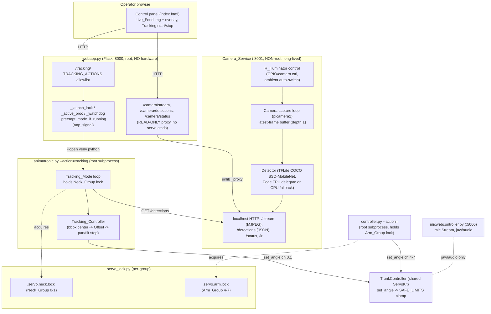

# Design Document: Camera Person Detection & Tracking

## Overview

This feature adds vision-based perception to the animatronic. A head-mounted
Raspberry Pi Camera Module 3 NoIR (plus an IR illuminator for darkness) feeds a
TensorFlow Lite COCO SSD-MobileNet detector. Detected people drive directional
head tracking (the neck pans/tilts to keep the person centered), specific
detections trigger audio-backed Routines, and a live feed with detection
overlays is surfaced in the existing Flask Control_Panel.

The feature fits the project's existing architecture rather than inventing
parallel mechanisms:

- **Camera_Service** is a NEW, separate, long-lived, **non-root** process that
  owns the camera, the Detector, and IR control. It exposes the latest frame
  and detections over a localhost HTTP interface (Req 1.7, 9.6). This mirrors
  how `micwebcontroller.py` already runs as a separate HTTP service that
  `webapp.py` proxies with `urllib`.
- **Tracking_Mode** is a NEW `Animatronic` action (`tracking`), launched as a
  root subprocess by `webapp.py` exactly like the existing `napping` / `awake`
  Modes. It holds a servo lock, loops reading detections, drives the neck via
  `TrunkController.set_angle`, and winds down on `nap_signal` (Req 6).
- The **servo lock is refactored from one whole-robot mutex into per-channel-
  GROUP locks** (`Neck_Group` = channels 0-1, `Arm_Group` = channels 4-7) so
  Tracking_Mode (neck) and an arm-only Gesture (arm) can run concurrently on
  disjoint channels (Req 8). A backward-compatible "acquire all groups"
  convenience preserves today's whole-robot behavior for existing routines.
- **webapp.py** gains read-only camera routes (proxied from Camera_Service) and
  a `tracking` Mode start/stop route guarded by an explicit allowlist, reusing
  the existing `_launch_lock` / `_active_proc` / `_preempt_mode_if_running`
  machinery (Req 2, 9).

Per the **animation-vocabulary** steering: Tracking_Mode is **Gesture-like**
toward the mic Stream — it carries no audio and never touches the jaw, so it may
run concurrently with a live mic Stream (Req 6.2, 6.3). Routines and Acts own
audio + the jaw motor and therefore **interrupt** Tracking_Mode (Req 6.4, 7.7).
An arm-only Gesture layers over Tracking_Mode because it owns only disjoint
`Arm_Group` channels (Req 6.6).

### Safety posture (from steering)

- Every servo write — tracking steps and Scan_Sweep alike — goes through
  `TrunkController.set_angle`, which clamps to `constants.SAFE_LIMITS` (Req 5.5,
  6.8, 6.11, 8.x). Tracking_Mode writes **only** `Neck_Group` channels (Req 5.8).
- Modes return to rest / recenter on wind-down and on error (Req 6.10, 8.7).
- `FORBIDDEN_COMBINATIONS` and `verified_pose_override` remain untouched; this
  feature never widens limits.
- **Physical servo-travel and collision validation is performed by the operator
  on hardware**, not simulated. The design and testing strategy therefore do
  NOT include `SERVO_SIM`-based collision/limit verification (no CLAMPED-warning
  inspection, no `SAFE_LIMITS` range checks, no `FORBIDDEN_COMBINATIONS`
  simulation). `SERVO_SIM=1` is used only as a hardware-free convenience for
  wiring/logic tests. Compile checks and non-safety logic tests (tracking math,
  lock behavior, allowlist, path validation, detection wiring) ARE in scope.

## Architecture

### Component / process topology



### Key interactions

**Tracking + arm Gesture concurrency (Req 6.6, 8.12).** Tracking_Mode holds
only the `Neck_Group` lock and writes only channels 0-1. An arm-only Gesture
(`controller.py --action=menacingReach`, etc.) holds only the `Arm_Group` lock
and writes only channels 4-7. The two lockfiles are independent `fcntl.flock`
anchors, so both processes run concurrently writing disjoint channels on the
shared class-level `ServoKit`.

**Routine preempts Tracking (Req 6.4, 6.5, 7.7, 8.9, 8.10).** A Routine/Act
needs the jaw/audio path and (typically) both neck and arm. When the operator
presses a Routine button, `webapp.py` calls `_preempt_mode_if_running()`, which
sets `nap_signal.request_stop()`. Tracking_Mode's loop observes the stop signal,
recenters the neck to `REST_POSITIONS`, releases the `Neck_Group` lock, and
exits within 1s. The Routine subprocess then acquires **both** groups (the
backward-compatible whole-robot acquisition) and runs. If Tracking_Mode does not
release within the bounded wait, the Routine's non-waiting `Neck_Group`
acquisition raises `ServoBusyError` and the entry point exits 3 (Req 8.10).

**Mic Stream coexistence (Req 6.3).** The mic Stream (`micwebcontroller.py`)
owns the jaw/audio GPIO, not servo channels. Tracking_Mode carries no audio and
never touches the jaw, so starting Tracking_Mode does NOT auto-stop the mic
(unlike Routines/Modes that own audio). This is the Gesture-toward-Stream rule.

### Six build steps → requirements

The requirements group work into six independently hardware-verifiable steps.
The design layers map onto them: Camera_Service capture (Step 1 / Req 1);
webapp camera routes + Live_Feed overlay (Step 2 / Req 2); Detector (Step 3 /
Req 3); Tracking_Controller Offset computation (Step 4 / Req 4); neck tracking
motion (Step 5 / Req 5); Detection_Routine_Map triggering (Step 6 / Req 7).
Cross-cutting: Tracking_Mode (Req 6), per-group lock (Req 8), security (Req 9),
IR night operation (Req 10).

## Components and Interfaces

### 1. `servo_lock.py` — per-channel-group locks (Req 8)

Refactor the single whole-robot mutex into per-group locks while preserving the
project-dir anchoring, world-rw perms rationale, `fcntl.flock` OS-auto-release,
wait/non-wait semantics, and `BUSY_EXIT_CODE = 3`.

**Group definition** (sourced from `constants`, never hardcoded channel ints):

```python
NECK_GROUP = "neck"   # channels (constants.NECK_PAN, constants.NECK_TILT) == (0, 1)
ARM_GROUP  = "arm"    # channels (4, 5, 6, 7)

GROUP_CHANNELS = {
    NECK_GROUP: (constants.NECK_PAN, constants.NECK_TILT),
    ARM_GROUP:  (constants.RT_ELBOW_ROTATOR, constants.RT_ELBOW_TILT,
                 constants.RT_SHOULDER_TILT, constants.RT_SHOULDER_ROTATOR),
}
```

**One lockfile per group**, each anchored in the user-owned project (`src/`)
dir with the existing world-rw `fchmod` treatment so root-run gesture scripts
and the user-run Control_Panel can both open them:

- `.servo.neck.lock` (env override `SERVO_NECK_LOCK_PATH`)
- `.servo.arm.lock`  (env override `SERVO_ARM_LOCK_PATH`)

Because each group has its own `flock`ed file, OS auto-release on process death
still holds per group (Req 8.8).

**API:**

```python
class ServoBusyError(Exception): ...          # unchanged
BUSY_EXIT_CODE = 3                            # unchanged

@contextmanager
def group_lock(group, wait=False):
    """Hold ONE group's lock for the block. ServoBusyError if held and
    wait=False (Req 8.4); blocks if wait=True (Req 8.5). Writes holder PID.
    On exit/error, returns ONLY that group's channels to REST_POSITIONS
    (Req 8.7)."""

@contextmanager
def group_locks(*groups, wait=False):
    """Atomically acquire MANY groups: all-or-none (Req 8.6). Acquire in a
    DETERMINISTIC order (sorted group name) to avoid deadlock; on any partial
    failure, release everything already taken and raise ServoBusyError. On
    exit/error, rest each held group's channels (Req 8.7)."""

@contextmanager
def servo_lock(wait=False):
    """BACKWARD-COMPAT: acquire ALL groups == today's whole-robot lock
    (Req 8.9). Existing neck+arm routines keep working unchanged."""

def group_is_locked(group) -> bool:
    """Non-destructive per-group probe (non-blocking acquire+release). Returns
    False if the lockfile can't even be opened — fail-safe for /status
    (Req 8.14, 8.15)."""

def locks_status() -> dict:
    """{'neck': bool, 'arm': bool} for the Control_Panel."""
```

**Rest-on-release scoping (Req 8.7).** Releasing a group drives only that
group's `GROUP_CHANNELS` to `constants.REST_POSITIONS`, via a `TrunkController`
(all writes through `set_angle`). It never touches channels outside the released
group. The whole-robot `servo_lock()` rests both groups (today's behavior).

**Invariant (Req 8.11, 8.2, 8.3):** two writers never hold the same group lock;
a non-waiting second acquirer of a held group always gets `ServoBusyError`. A
writer only writes channels in groups whose lock it holds.

### 2. `camera_service.py` — NEW non-root process (Req 1, 3, 9.6, 10)

Long-lived service owning the camera, Detector, and IR control. Runs as a normal
user (NO `sudo`): `.venv/bin/python3 src/camera_service.py`. Flask app on
`localhost:8001` (loopback bind only — frames/detections never leave the device,
Req 9.7).

**Capture loop** (picamera2): configure a video stream at the configured
resolution/fps (defaults chosen to sustain >= 5 fps; Req 1.3), run headless, and
in a background thread continuously `capture_array()` into a single latest-frame
slot guarded by a lock (depth-1, newest-wins; Req 1.2, 1.4). On capture failure
after init, retain the last good frame and record a capture error (Req 1.6).
If the device can't open within 10s of start, print an init error naming the
camera and `sys.exit(non-zero)` so the Control_Panel keeps running (Req 1.5).

**localhost HTTP interface** (consumed by `webapp.py` via the existing `_proxy`
urllib pattern, and by Tracking_Mode via a thin client):

| Method | Path | Purpose | Requirements |
|---|---|---|---|
| GET | `/stream` | MJPEG `multipart/x-mixed-replace` of latest frames **with overlay** when `?overlay=1` | 2.1-2.4 |
| GET | `/detections` | JSON `{frame_id, width, height, ts, detections:[Detection...]}` | 3.4, 4, 6 |
| GET | `/status` | JSON `{camera_ok, capturing, fps, last_frame_age_s, edge_tpu, ir}` | 1.5/1.6, 2.5/2.6, 3.6, 10.6 |
| POST | `/ir` | `{"mode":"on"|"off"|"auto"}` set IR control mode | 10.3 |

The MJPEG endpoint renders overlays server-side (boxes + `label conf` text) so
the browser just shows an ``; detections JSON is also exposed for clients
that want raw data (Tracking_Mode uses `/detections`, not the pixel stream).

**Frame throttle.** `/stream` emits at a configurable 1-30 fps independent of
capture fps (Req 2.2).

### 3. `detector.py` — Detector inside Camera_Service (Req 3, 10.2)

Wraps a TFLite COCO SSD-MobileNet interpreter.

```python
class Detector:
    def __init__(self, model_path, labels_path, conf_threshold=0.5,
                 use_edge_tpu=False): ...
    def detect(self, frame) -> list[Detection]:
        """Run inference on one frame; return Detections with confidence >=
        threshold (Req 3.1-3.3). Each Detection has a COCO label, score in
        [0,1], and a pixel bbox bounded by frame dims (Req 3.2). person-class
        Detections are flagged is_person (Req 3.7)."""
```

**Edge TPU with CPU fallback (Req 3.5, 3.6).** When `use_edge_tpu` is set, try
`Interpreter(model_path, experimental_delegates=[load_delegate('libedgetpu.so.1')])`
(the `*_edgetpu.tflite` model). On `ValueError`/`OSError` (delegate missing or
device absent), fall back to a CPU `Interpreter(model_path)` and `print()` a
clear "Edge TPU unavailable -> CPU fallback" indication. Confidence threshold is
configurable in `[0.0, 1.0]`, default `0.5` (Req 3.3).

> Library note: `tflite-runtime` wheel availability is Python-version and
> architecture specific on the Pi (and the Edge TPU path additionally needs the
> system `libedgetpu` runtime). `picamera2` ships via apt on Raspberry Pi OS.
> Exact pins must be verified against the target Pi's OS/Python at install time
> (see Testing Strategy / requirements.txt note). The capture pattern
> (`capture_array()` + `MJPEGEncoder`) and the detector pattern
> (`Interpreter` + `load_delegate` with CPU fallback) are the stable public
> APIs this design relies on.

### 4. `tracking_controller.py` — Tracking_Controller (Req 4, 5)

Pure-ish logic: converts the selected `Target_Person` bbox center into smoothed
pan/tilt step commands, writing ONLY `Neck_Group` through
`TrunkController.set_angle`. The selection + Offset + step math is a pure
function (easily unit/property tested); only the final `set_angle` call touches
hardware.

```python
@dataclass
class TrackingConfig:
    deadband_frac_w: float = 0.05   # Req 4.4
    deadband_frac_h: float = 0.05
    max_step_deg: float = 5.0       # Req 5.6 (clamped to [1, 30])
    conf_threshold: float = 0.5

def select_target(detections, frame_w, frame_h) -> Detection | None:
    """Largest bbox area; tie-break closest-to-center (Req 4.1, 4.2).
    Deterministic for identical input."""

def compute_offset(target, frame_w, frame_h, cfg) -> Offset:
    """Signed pixel Offset of bbox center vs Frame_Center. +x = right of
    center, +y = below center (Req 4.3). Zero both axes inside the deadband
    (Req 4.4). No target -> Offset(0,0,has_target=False) (Req 4.5, 5.9)."""

def next_neck_targets(offset, cur_pan, cur_tilt, cfg) -> dict[int, float]:
    """Map Offset sign -> pan/tilt step, honoring constants' axis directions:
      - person to the LEFT  (offset.x < 0) -> INCREASE NECK_PAN  (Req 5.1)
      - person to the RIGHT (offset.x > 0) -> DECREASE NECK_PAN  (Req 5.2)
      - person BELOW center (offset.y > 0) -> INCREASE NECK_TILT (Req 5.3)
      - person ABOVE center (offset.y < 0) -> DECREASE NECK_TILT (Req 5.4)
    Step magnitude capped at cfg.max_step_deg (Req 5.6). Returns {} when no
    target so the caller issues no command and holds angle (Req 5.9)."""
```

> Axis-direction grounding (from `constants.py`): `NECK_PAN` increase = head
> turns to its LEFT, decrease = RIGHT; `NECK_TILT` increase = head lowers,
> decrease = raises. A person whose bbox center is left of frame center is to
> the animatronic's left, so pan must INCREASE to face them — matching Req 5.1.

The controller only computes targets; the Tracking_Mode loop applies them with
`TrunkController.set_angle(ch, angle)` (final SAFE_LIMITS clamp, Req 5.5) within
500 ms of a new detection (Req 5.7) and writes only channels 0,1 (Req 5.8).

### 5. Tracking_Mode — `tracking` action in `animatronic.py` (Req 6)

A new `Animatronic.tracking(...)` method registered in `action_map` as
`tracking`, following the exact shape of `napping` / `awake`:

- Launched as root: `sudo .venv/bin/python3 src/animatronic.py --action=tracking`.
- New CLI flags mirroring `--nap-timeout`: `--scan-timeout` (default 10, range
  1-120; Req 6.10), `--max-step`, `--deadband`, `--conf`, `--camera-url`
  (default `http://localhost:8001`).
- Acquires the **`Neck_Group` lock** (not the whole robot) for its run, so an
  arm Gesture can coexist (Req 6.6).
- Clears `nap_signal` at start; loops: GET `/detections` from Camera_Service →
  `select_target` → `compute_offset` → `next_neck_targets` → `set_angle` on
  channels 0,1. Checks `nap_signal.stop_requested()` each iteration; on stop,
  recenters neck to `REST_POSITIONS` for the Neck_Group, releases the lock,
  exits within 1s (Req 6.4, 6.5).
- No `AudioPlayer`, never writes the jaw motor (Req 6.2).
- **Leave-frame → Scan_Sweep (Req 6.7-6.10):** when no `person` detection is
  present, run a slow eased pan across the `NECK_PAN` safe range (an incremental
  `set_angle` sweep in `_run_scan_sweep`, honoring the configurable scan
  range/timeout). Every neck command still goes through `set_angle` (Req 6.8). If a person
  reappears mid-sweep, stop and resume tracking (Req 6.9). If the scan timeout
  elapses with no reacquire, recenter to `REST_POSITIONS` and yield to the
  previously active Mode (Req 6.10).
- Runs the open-ended Mode loop in `asyncio.run(...)` at the top of the call
  stack (per the async rule); gets NO `GESTURE_TIMEOUT` watchdog from webapp.
- **Sensor role (Req 6.12):** person Detections from Camera_Service can serve as
  the interrupting "sensor" for Sleep/Awake modes where those modes are
  configured to be interrupted by person detection.

### 6. Detection-triggered Routines — `Detection_Routine_Map` (Req 7)

A configurable map from a detection condition to a Routine action name that must
exist in `action_map`. Seeded defaults: `person -> wave` (Req 7.3) and
`person+dog -> walkYourDog` (Req 7.4). This logic lives alongside Tracking_Mode
(it already reads `/detections`), but requesting a Routine is the point where
Tracking yields: the trigger winds down Tracking_Mode and releases the
`Neck_Group` before the Routine drives jaw/audio (Req 7.7).

- **Allowlist dispatch (Req 7.1, 7.6, 9.1-9.3):** a mapped action name is
  dispatched only if present in `action_map` (the existing allowlist). An
  unknown name is rejected, no subprocess/servo command runs, and the rejected
  name is printed. Never `getattr`/`eval`/shell on the name.
- **Condition arbitration (Req 7.5):** when multiple conditions match, pick the
  one matching the greatest number of detected classes; ties → earliest-defined
  entry.
- **Cooldown (Req 7.8):** after a condition fires its Routine, that
  condition→Routine pair is blocked until a configurable cooldown
  (1-600s, default 30s) elapses since the Routine completed.

### 7. `webapp.py` — camera + tracking routes (Req 2, 9)

Reuse `_proxy` (urllib), `_launch_lock`, `_active_proc`, `_watchdog`,
`_preempt_mode_if_running`.

**Read-only camera routes (Req 2.7 — never issue a servo command):**

| Route | Behavior |
|---|---|
| `GET /camera/stream` | Proxy/surface Camera_Service `/stream` as `multipart/x-mixed-replace`; `` in the panel. Req 2.1-2.4 |
| `GET /camera/detections` | Proxy `/detections` JSON for optional client overlay. Req 2.3 |
| `GET /camera/status` | Proxy `/status`; drives "camera unavailable" (Req 2.5) and "stalled feed" (Req 2.6, via `last_frame_age_s`) indicators |
| `POST /camera/ir` | Proxy `/ir` with `{"mode": "on"|"off"|"auto"}` validated against a fixed set. Req 10.3 |

If Camera_Service is unreachable, `_proxy` returns a 502 and the panel shows a
"camera unavailable" status while all other controls stay usable (Req 2.5).

**Tracking Mode route (mirrors `/nap`, `/awake`):**

```python
TRACKING_ACTIONS = {'tracking'}   # explicit allowlist (Req 9.1, 9.2)

@app.route('/tracking/<state>', methods=['POST'])
def tracking(state):
    # 'start' -> launch_tracking(...) under _launch_lock; tracked in
    #            _active_proc with label 'tracking'; NO watchdog (open-ended
    #            Mode); preemptible by routines via _preempt_mode_if_running.
    # 'stop'  -> nap_signal.request_stop()
```

`launch_tracking` mirrors `launch_napping`/`launch_awake`: check-and-spawn under
`_launch_lock`, Popen the venv python with fixed `ANIMATRONIC` path + validated
`--action=tracking` as separate argv (never shell). Add `'tracking'` to the
`_MODE_LABELS` tuple so `_preempt_mode_if_running` treats it as a preemptible
Mode. Because Tracking is Gesture-like toward the Stream, `launch_tracking` does
**not** auto-stop the mic.

**Path-value validation (Req 9.4, 9.5):** any route that accepts a value which
becomes a filesystem path (e.g. a selectable detector `model` or tuning config
name) validates it against an explicit allowlist of permitted names, OR resolves
the path and confirms it stays within a designated base dir
(`os.path.realpath` under `MODELS_DIR`). On failure: reject, read/write nothing,
return an "invalid value" response.

### 8. IR control — inside Camera_Service (Req 10)

IR is owned by the non-root Camera_Service (GPIO via `gpiozero`, or camera
control), since root is confined to servo/GPIO Servo_Writers but the IR
illuminator is a camera-side concern.

- Modes: `on`, `off`, `auto` (Req 10.3).
- `auto`: enable IR when measured ambient light < configurable threshold,
  disable when it rises above (hysteresis to avoid flapping; Req 10.4). Ambient
  light is read from camera frame luminance (mean of a downscaled frame) or a
  light sensor if present.
- Graceful degrade (Req 10.5): if IR hardware is absent/fails, keep operating in
  available light and report "IR unavailable" via `/status`.
- State changes (on↔off) are reported to the Control_Panel via `/status`
  (Req 10.6).

## Data Models

```python
@dataclass(frozen=True)
class Detection:
    label: str          # COCO class, e.g. "person", "dog"
    score: float        # confidence in [0.0, 1.0]  (Req 3.2)
    x1: int; y1: int    # bbox top-left, pixels (bounded by frame dims)
    x2: int; y2: int    # bbox bottom-right, pixels
    @property
    def is_person(self) -> bool: return self.label == "person"   # Req 3.7
    @property
    def area(self) -> int: ...        # (x2-x1)*(y2-y1), for target selection
    @property
    def center(self) -> tuple[int, int]: ...

@dataclass(frozen=True)
class Offset:
    dx: int             # +right of Frame_Center, -left   (Req 4.3)
    dy: int             # +below Frame_Center,   -above
    has_target: bool    # False when no Target_Person     (Req 4.5)

@dataclass
class DetectionRule:               # one Detection_Routine_Map entry (Req 7.1)
    required_classes: tuple[str, ...]   # e.g. ("person",) or ("person","dog")
    action: str                         # must be in action_map (Req 7.6)
    cooldown_s: int = 30                # 1..600  (Req 7.8)

@dataclass
class TrackingConfig:              # tuning (persisted like jaw tuning)
    resolution: tuple[int, int] = (640, 480)   # 320x240..1920x1080  (Req 1.3)
    capture_fps: int = 15                       # 5..30
    stream_fps: int = 10                        # 1..30               (Req 2.2)
    conf_threshold: float = 0.5                 # 0.0..1.0            (Req 3.3)
    deadband_frac_w: float = 0.05               # Req 4.4
    deadband_frac_h: float = 0.05
    max_step_deg: float = 5.0                   # 1..30               (Req 5.6)
    scan_timeout_s: int = 10                     # 1..120              (Req 6.10)
    ir_mode: str = "auto"                        # on|off|auto         (Req 10.3)
    ir_ambient_threshold: float = ...            # Req 10.4
    use_edge_tpu: bool = False                   # Req 3.5
```

Group lock model (conceptual): `GROUP_CHANNELS: dict[str, tuple[int,...]]` maps
`"neck" -> (0,1)` and `"arm" -> (4,5,6,7)`, derived from `constants`.

Tuning persists where the project already persists tuning
(`src/config/tuning.json`), reusing the existing config_store pattern; thresholds
and bounds are validated/clamped on read.

## Correctness Properties

*A property is a characteristic or behavior that should hold true across all
valid executions of a system — essentially, a formal statement about what the
system should do. Properties serve as the bridge between human-readable
specifications and machine-verifiable correctness guarantees.*

These properties target the **pure logic** of the feature (tracking math,
selection, config clamping, the lock model, allowlist/path validation, cooldown,
IR hysteresis). They are deliberately independent of physical servo-range and
collision validation, which the operator performs on hardware and which is NOT
simulated here.

### Property 1: Latest-frame buffer is newest-wins, depth 1

*For any* non-empty sequence of frames pushed to the exposed-frame buffer, a
reader always receives the most recently pushed frame, and the buffer never
retains more than one frame.

**Validates: Requirements 1.2, 1.4**

### Property 2: Config values are clamped into their valid range

*For any* requested configuration value (resolution, capture fps, stream fps,
confidence threshold, max step, scan timeout, cooldown), the accepted value lies
within that field's documented `[min, max]` range.

**Validates: Requirements 1.3, 2.2, 3.3, 5.6, 6.10, 7.8**

### Property 3: Detections are normalized to valid score and in-frame bbox

*For any* raw model output and frame dimensions, every reported Detection has a
score in `[0.0, 1.0]` and a bounding box whose coordinates are within the
captured frame dimensions.

**Validates: Requirements 3.2**

### Property 4: Confidence threshold filtering is exact

*For any* list of detections and any threshold in `[0.0, 1.0]`, the reported
detections are exactly those whose score is greater than or equal to the
threshold, and none below it is reported.

**Validates: Requirements 3.3**

### Property 5: Person classification flag

*For any* Detection, `is_person` is true if and only if its label is `person`.

**Validates: Requirements 3.7**

### Property 6: Target selection is largest-area with deterministic center tie-break

*For any* non-empty set of person Detections, the selected Target_Person has the
maximum bounding-box area; when two or more share the maximum area, the selected
one has the smallest distance from its bbox center to Frame_Center, and the
selection is deterministic for identical input.

**Validates: Requirements 4.1, 4.2**

### Property 7: Offset sign convention

*For any* Target_Person whose bbox center lies outside the Deadband, the
horizontal Offset is positive exactly when the center is right of Frame_Center
and the vertical Offset is positive exactly when the center is below
Frame_Center.

**Validates: Requirements 4.3**

### Property 8: Deadband zeroing

*For any* Target_Person whose bbox center is within the Deadband half-width of
Frame_Center on both axes, both the horizontal and vertical Offset are reported
as zero.

**Validates: Requirements 4.4**

### Property 9: Neck command reduces the offset (correct direction)

*For any* non-zero Offset, the commanded neck step moves the head so as to
reduce that Offset — increasing `NECK_PAN` when the person is to the
animatronic's left and decreasing it when to the right, and increasing
`NECK_TILT` when the person is below center and decreasing it when above —
following the axis-direction conventions in `constants.py`.

**Validates: Requirements 5.1, 5.2, 5.3, 5.4**

### Property 10: Smoothing caps the per-update step

*For any* Offset, current neck angle, and configured maximum step, the magnitude
of the commanded change from the current angle is no greater than the maximum
step.

**Validates: Requirements 5.6**

### Property 11: Tracking writes only Neck_Group channels

*For any* input to the Tracking_Controller, the set of channels it commands is a
subset of the Neck_Group channels `{NECK_PAN, NECK_TILT}` (0 and 1).

**Validates: Requirements 5.8, 8.3**

### Property 12: No target yields no command

*For any* detection input containing no person, the Tracking_Controller reports
no Target_Person, reports both Offsets as zero, and issues no neck command (an
empty target map), so the neck holds its current angle.

**Validates: Requirements 4.5, 5.9**

### Property 13: Same-group lock mutual exclusion

*For any* channel group, while one process holds that group's lock, a second
process's non-waiting acquisition of the same group always raises a busy error
and is not granted the lock.

**Validates: Requirements 8.11, 8.4, 8.2**

### Property 14: Disjoint groups run concurrently

*For any* two distinct channel groups, a process holding one group's lock does
not prevent another process from acquiring the other group's lock.

**Validates: Requirements 8.12**

### Property 15: Multi-group acquisition is all-or-none

*For any* multi-group acquisition request where at least one requested group is
already held by another process, the requester is granted none of the groups
(no partial acquisition remains held after the failed request).

**Validates: Requirements 8.6**

### Property 16: Release rests only the released group's channels

*For any* channel group, releasing its lock drives exactly that group's channels
(per `GROUP_CHANNELS`) to `REST_POSITIONS` and writes no channel belonging to
any other group.

**Validates: Requirements 8.7**

### Property 17: Status probe fail-safe

*For any* per-group status probe that cannot open its lockfile, the probe
reports that group as not held rather than raising an error.

**Validates: Requirements 8.15**

### Property 18: Allowlist gates all dispatch

*For any* externally supplied action name, a subprocess or Routine dispatch
occurs if and only if that name is present in the allowlist (`action_map` /
route allowlist); a name not in the allowlist is rejected and never launches a
subprocess or issues a servo command.

**Validates: Requirements 7.6, 9.1, 9.2**

### Property 19: Path values stay within the designated base directory

*For any* web-route-supplied value that becomes a filesystem path, the value is
accepted only when it is in the permitted-name allowlist or its resolved real
path remains within the designated base directory; any value resolving outside
the base directory (including traversal sequences) is rejected and no path is
read or written.

**Validates: Requirements 9.4, 9.5**

### Property 20: Detection→Routine arbitration is most-specific, earliest-on-tie

*For any* set of simultaneously satisfied Detection_Routine_Map conditions, the
selected condition is the one matching the greatest number of detected object
classes, and when counts are equal the earliest-defined condition is selected
(deterministic).

**Validates: Requirements 7.5**

### Property 21: Cooldown blocks re-fire within the window

*For any* condition that has fired its Routine, a re-fire request is blocked when
the elapsed time since completion is less than the configured cooldown and
allowed once the elapsed time reaches or exceeds the cooldown.

**Validates: Requirements 7.8**

### Property 22: IR auto-switch follows the ambient hysteresis rule

*For any* sequence of ambient-light readings and a configured threshold, the IR
auto-switch decision enables the IR_Illuminator when the reading falls below the
low threshold and disables it when the reading rises above the high threshold,
deterministically for identical input.

**Validates: Requirements 10.4**


## Error Handling

| Condition | Handling | Req |
|---|---|---|
| Camera can't init within 10s | print init error naming the camera; `sys.exit(non-zero)`; Control_Panel keeps running | 1.5 |
| Capture fails after init | print capture error; retain last good frame as the exposed frame | 1.6 |
| Camera_Service unreachable from webapp | `_proxy` 502; panel shows "camera unavailable"; other controls usable | 2.5 |
| Live_Feed stalls | `/status.last_frame_age_s` exceeds threshold → "stalled feed" indicator within 5s | 2.6 |
| Edge TPU configured but unavailable | catch delegate load error; fall back to CPU `Interpreter`; print fallback indication | 3.6 |
| IR hardware absent/fails | continue in available light; `/status` reports IR unavailable | 10.5 |
| Group lock busy, non-waiting | `ServoBusyError`; CLI exits `BUSY_EXIT_CODE` (3) | 8.4 |
| Multi-group partial acquisition | release all taken; grant none; `ServoBusyError` | 8.6 |
| Routine preempt times out | Tracking didn't release Neck_Group in time → Routine's non-waiting acquire raises busy → exit 3 (don't write neck) | 8.10 |
| Scan timeout, no reacquire | recenter neck to `REST_POSITIONS`; yield to previous Mode | 6.10 |
| Any Tracking_Mode loop error | recenter Neck_Group to rest; release lock; clear `nap_signal`; exit | 6.x, 8.7 |
| Unknown action name (map or route) | reject; no subprocess/servo command; print/return the rejected name | 7.6, 9.2 |
| Path value fails validation | reject; read/write nothing; return "invalid value" | 9.5 |

All servo cleanup paths drive only through `set_angle`/`return_to_rest`
(SAFE_LIMITS clamp) and rest only the released group's channels.

## Testing Strategy

**Scope boundary (operator hardware validation).** Physical servo travel limits,
collisions, and `FORBIDDEN_COMBINATIONS` are validated by the operator on the
real robot and are explicitly NOT simulated here. No test in this strategy
inspects CLAMPED warnings, verifies commanded angles against `SAFE_LIMITS`
ranges, or simulates forbidden combinations. `SERVO_SIM=1` is used only as a
hardware-free convenience to exercise flow/wiring, not as a safety gate.

**Property-based tests** (Hypothesis, already a dependency; >= 100 iterations
each; tagged `Feature: camera-person-detection-tracking, Property N: <text>`)
cover the pure tracking/lock-model/validation logic — see Correctness Properties.

**Unit / example tests:**
- Detector wiring: with a stubbed interpreter, confidence filtering excludes
  below-threshold detections; person flag set for `person` label; Edge-TPU
  fallback path prints indication and uses CPU interpreter (mocked
  `load_delegate` raising).
- `Detection_Routine_Map`: default entries present; arbitration picks the
  most-specific condition and earliest on ties; cooldown blocks re-fire; unknown
  action rejected.
- webapp routes: allowlist rejects unknown tracking/camera actions (400); camera
  routes issue no servo command; `_preempt_mode_if_running` treats `tracking` as
  a Mode; path-value validation rejects traversal/out-of-base values.
- servo_lock: a second non-waiting `group_lock` on a held group raises
  `ServoBusyError`; disjoint groups acquire concurrently; `group_locks`
  all-or-none rolls back on partial failure; `group_is_locked` fail-safes to
  False when the file can't be opened. (Lock semantics are tested via real
  `fcntl.flock` across subprocesses; no servo hardware involved — `SERVO_SIM=1`
  for the rest-on-release path.)

**Integration (hardware-free):**
- Fake/sim camera: a stub Camera_Service serving canned frames + `/detections`
  so Tracking_Mode and webapp proxying can be exercised end-to-end without a
  camera. Run the motion layer under `SERVO_SIM=1`.
- Edge TPU is exercised only via mock (the delegate load) — no Coral hardware in
  CI.

**Compile checks:** `python -m py_compile` on all new/changed modules
(`servo_lock.py`, `camera_service.py`, `detector.py`, `tracking_controller.py`,
`animatronic.py`, `webapp.py`) to catch syntax/import errors before the operator
runs anything on the robot.

**Dependencies to add (versions verified at install against the target Pi
OS/Python — `tflite-runtime` and `libedgetpu` are arch/Python specific;
`picamera2` installs via apt on Raspberry Pi OS):** `picamera2`,
`tflite-runtime` (or `pycoral` for the Edge TPU path), and an image util
(`opencv-python` or `Pillow`) for overlay drawing. Pin exact versions in
`requirements.txt` once confirmed on hardware.
